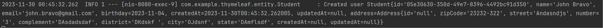
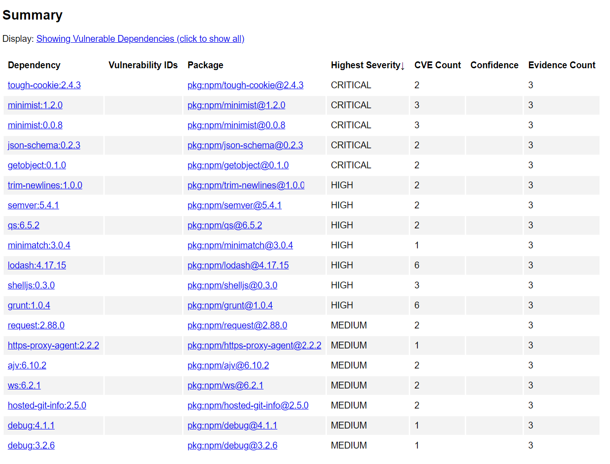

### Zadanie 2

Jak uruchomiono?
```commandline
docker run -v C:\Users\patry\IdeaProjects\Java\TBO-task2:/path zricethezav/gitleaks:latest detect --source="/path" -v 
```

Co zostało wykryte?

Te 3 piki zawierają klucze prywatne, które nie powinny znaleźć się w repozytorium:


Propozycja naprawy problemu:

Można przenieść sekrety do Vaulta, który będzie przechowywał je bezpiecznie w chmurze lub na serwerach firmy on-site.
Dostęp do Vaulta i jego sekretów następuje z użyciem tokenu, który jest otrzymywany po wcześniejszym uwierzytelnieniu i autoryzacji
użytkownika.