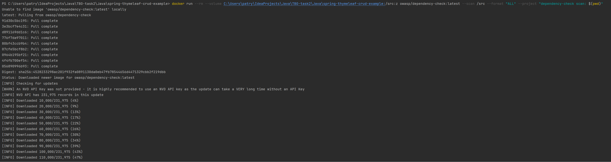

# Zadanie 3

### Wynik wykonania komendy (początek):

### Lista wykrytych podatności:

### Wybrana podatność krytyczna:

### Opis:

Prototype Pollution jest to rodzaj ataku, który występuje w językach programowania, takich jak JavaScript, które korzystają z mechanizmu prototypów do dziedziczenia właściwości i metod między obiektami.

Atak polega na wykorzystaniu luk w sposobie, w jaki język programowania zarządza prototypami, aby zmienić lub nadpisać właściwości lub metody prototypu, co może prowadzić do nieoczekiwanych zachowań programu lub wywoływania niebezpiecznego kodu.

Przykładowo, gdy programista nie sprawdza dokładnie danych wejściowych, złośliwy użytkownik może manipulować prototypami obiektów i dodać niebezpieczne właściwości lub metody do istniejących prototypów. To z kolei może umożliwić atakującemu uzyskanie dostępu do poufnych danych, wykonanie złośliwego kodu lub naruszenie integralności aplikacji.

Aby zabezpieczyć się przed atakami związanymi z prototypowym zanieczyszczeniem, programiści powinni być ostrożni podczas zarządzania prototypami obiektów. Należy stosować sprawdzanie poprawności danych wejściowych, unikać niebezpiecznych operacji na prototypach i regularnie aktualizować oprogramowanie w celu łatania ewentualnych luk bezpieczeństwa.

### Analiza:
Pakiet JavaScript "tough-cookie" zawierający podatność "Prototype Pollution" jest zależnością pakietu JavaScript "jquery-mask-plugin",
który jest wykorzystywany w formularzach na froncie aplikacji.

### Rozwiązanie problemu występowania podatności:

Aktualizacja pakietu "tough-cookie" do wersji 4.1.3, która nie zawiera już tej podatności.

Jednakże, jest to zależność pakietu "jquery-mask-plugin", więc należałoby zaaktualizować wersję tego pakietu, aby
zachować kompatybilność wersji. 
Niestety "jquery-mask-plugin" jest zainstalowana już w najnowszej wersji.
Należałoby więc sprawdzić czy podniesienie wersji pakietu "tough-cookie" do wersji 4.1.3 (zależności pakietu "jquery-mask-plugin")
nie zepsuje pakietu "jquery-mask-plugin". 
Jeśli zepsuje, sugerowałbym zrezygnowanie z pakietu "jquery-mask-plugin", gdyż od 4 lat nie był aktualizowany.
Natomiast pakiet "tough-cookie" był aktualizowany kilka miesięcy temu.
